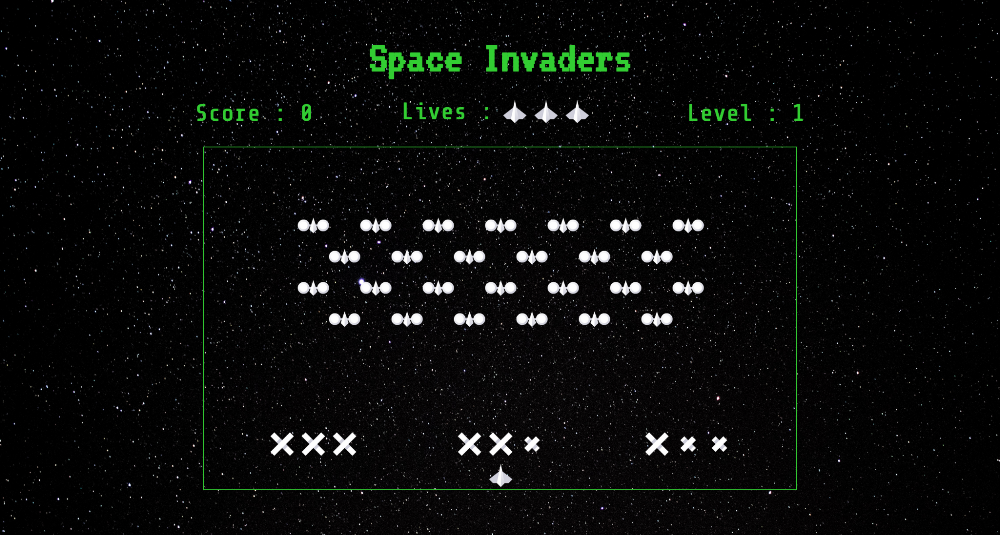
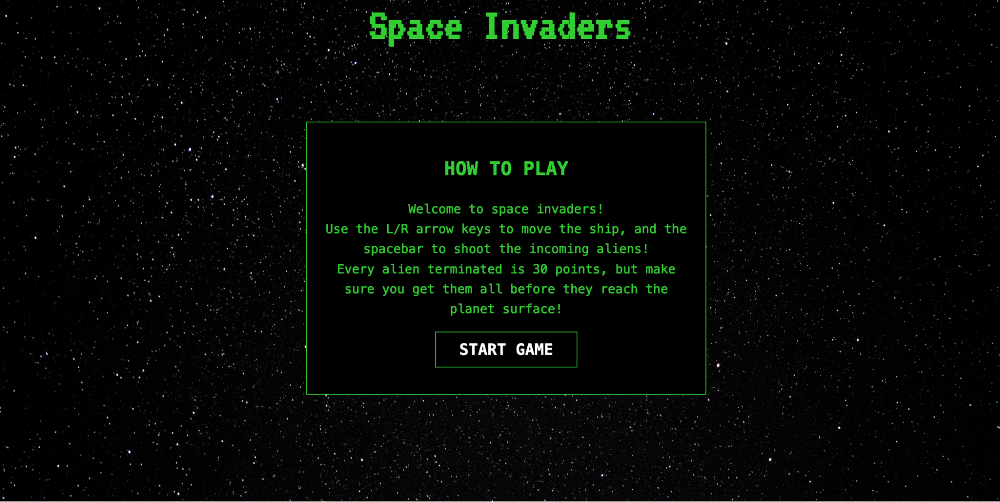
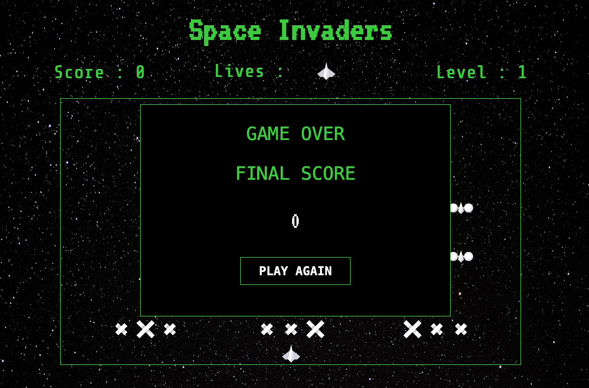
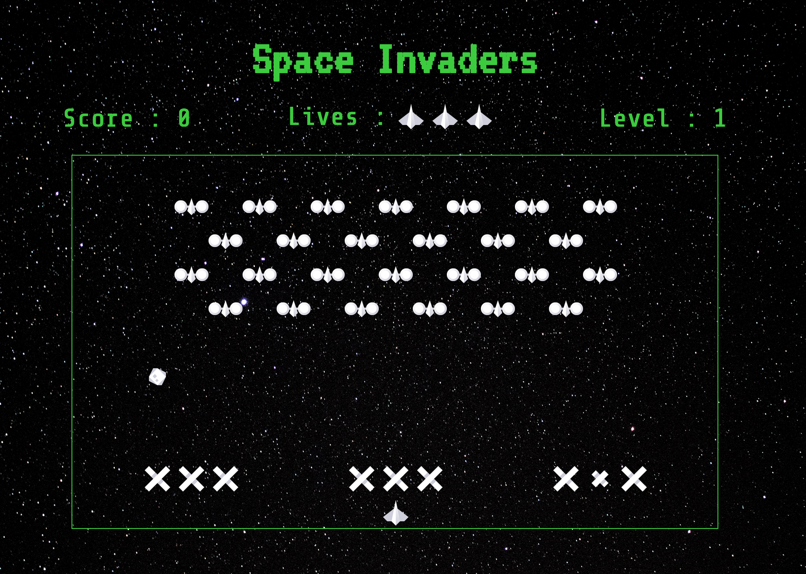

# SPACE INVADERS - GA PROJECT 01

## <a name='overview'>OVERVIEW</a>

This is my first dev project for the General Assembly Software Engineering Immersive course, and my first ever programming project.



### TABLE OF CONTENTS

- [Overview](#overview)
  - [Technologies Used](#technologies)
  - [Deployment](#deployment)
  - [Gameplay](#gameplay)
  - [Brief](#brief)
- [Development Process](#dev-process)
  - [Planning](#planning)
  - [Reaching MVP](#mvp)
  - [Stretch Goals](#stretch)
- [Wins & Challenges](#wins-challenges)
- [Bugs & Known Errors](#bugs)
- [Future Improvements](#improvements)
- [Key Learnings](#learnings)

### <a name='technologies'>TECHNOLOGIES USED</a>

- HTML5
- CSS3
- JavaScript
- Git / GitHub

### <a name='deployment'>DEPLOYMENT</a>

This project is deployed with GitHub Pages and is available [here](https://hannah-hill.github.io/space-invaders/).

### <a name='gameplay'>GAMEPLAY</a>

Space Invaders is a classic arcade game from the 80s. The player aims to shoot an invading alien armada, before it reaches the planet's surface using a mounted gun turret.

The player can only move left or right. The aliens also move from left to right, and also down each time they reach the side of the screen. The aliens also periodically drop bombs towards the player. Once the player has destroyed a wave of aliens, the game starts again. The aim is to achieve the highest score possible before either being destroyed by the aliens, or allowing them to reach the planet's surface.

My iteration pays homage to the original Space Invaders game, with arcade-esque styling that sparks nostalgia for players.

### <a name='brief'>BRIEF</a>

## <a name='dev-process'>DEVELOPMENT PROCESS</a>

### <a name='planning'>PLANNING</a>

I started with extensive research - I played approximately 200 games of space invaders online before heading to [Four Quarters Arcade Bar](https://fourquarters.bar/) in Peckham for additional (and beer-fuelled) arcade inspiration.

Practical research complete, I spent most of my first day planning. I began by sketching out an initial wireframe to visualise the page’s HTML structure. I then listed the functionality I wanted my game to have, before establishing which features were critical for my MVP, versus stretch goals should I have extra time.

Using my wireframe and MVP plan, I drafted some pseudocode for guidance. Here’s an example of pseudocode for the player movement logic:

```
/// HANDLE PLAYER MOVEMENT
Create a movePlayer function with paramaters for changeInIndex (arguments either 1 or -1)
and for .
Inside create const newIndex = playerIndex + changeInIndex.
if player is on the edge, return to exit the function.
otherwise, call move function with newIndex as an argument.

function move(newIndex) playerCells[playerIndex].classList.remove('activePlayer`)

Create handleArrowLeft() and handleArrowRight() functions. The former will pass -1 into the
movePlayer function, while the latter will pass in 1. Both functions will also have functions to
check whether the player is at the left or right boundary of  playerCells, and pass the result
into the movePlayer function.
Add event listener to keydown and add a switch statement for ArrowLeft and ArrowRight, to execute handlers.
```

### <a name="mvp">REACHING MVP</a>

#### Building the grid

First up was building the game grid. I used the `from()` and `fill()` array methods to create rows of a fixed length, and `concat()` to construct a grid of 11 rows. I then used `forEach()` to loop over the grid array and for each index: create a `div` element; create class names from the index and fill string; and append the div to the main grid div in my HTML.

```
gridMap.forEach((className, i) => {
  const newCell = document.createElement("div")
  grid.appendChild(newCell)
  newCell.classList.add(className, i)
})
```

#### Player start position & movement

Next was initialising the player’s starting position in the grid and allowing the player to move within the bottom row. I added a player class to the grid `div` at the correct starting index, and created a variable based on the current index of the player class to allow for movement. I added event listeners and functions to handle left and right arrow keydowns, including logic to check if the player had reached the edge of the grid.

```
////////// INITIALISING THE PLAYER //////////////////////////////////////

const playerStart = allCells[199]
playerStart.classList.add("player")
playerIndex = allCells.indexOf(playerStart)

function handleArrowLeft() {
  console.log("handleArrowLeft")
  const leftBoundaryCheck = (playerIndex) =>
    playerIndex <= allCells.length - row.length
  moveCannon(-1, leftBoundaryCheck)
}

function handleArrowRight() {
  console.log("handleArrowRight")
  const rightBoundaryCheck = (playerIndex) => playerIndex >= allCells.length - 1
  moveCannon(1, rightBoundaryCheck)
}

function moveCannon(changeInIndex, boundaryCheck) {
  const newIndex = playerIndex + changeInIndex
  if (boundaryCheck(playerIndex)) {
    console.log("The cannon cannot move any further!")
    return
  }
  move(newIndex)
}

function move(newIndex) {
  allCells[playerIndex].classList.remove("player")
  allCells[newIndex].classList.add("player")
  playerIndex = newIndex
}
```

#### Aliens

I suspected that getting the aliens to move in sequence would be one of the more challenging aspects of my project. I decided to work initially with just one alien, initialising it and coding the movement functionality, before adding in the entire army. I wrote a function to move the aliens across the grid at a set interval, checking each time to see if some hit the edges of the grid. If the aliens reach the edge, they will move down and start in the other direction. However, if they have hit the bottom player row, it’s game over.

```
function moveAliens(indexChange) {
  const rightBoundary = (alienIndex) => (alienIndex + 1) % 19 === 0
  const leftBoundary = (alienIndex) => alienIndex === 0 || alienIndex % 19 === 0
  switch (indexChange) {
    case 1:
      if (alienIndex.some(rightBoundary)) {
        stopAliens(indexChange)
        return
      }
      break
    case -1:
      if (alienIndex.some(leftBoundary)) {
        stopAliens(indexChange)
        return
      }
      break
  }
  for (let i = 0; i < alienIndex.length; i++) {
    allCells[alienIndex[i]].classList.remove("alien")
    alienIndex[i] = alienIndex[i] + indexChange
    allCells[alienIndex[i]].classList.add("alien")
  }
}
```

#### Bombs & Lasers

With the aliens and player moving correctly, it was time to add some fun - bombs and lasers! For the player to shoot lasers at the alien armada, I added an event listener for the space bar. On keydown, a bullet is generated at the player’s current index and moves up the grid at a set interval. If it hits an alien, it calls a function to kill the alien, removing it from the grid, and increases the player’s score accordingly. If there are no aliens left on the grid, the aliens regenerate to their starting position and the level increases by 1. Here’s my `killAlien` function:

```
function killAlien(newBullet) {
  allCells[newBullet].classList.remove("alien")
  alienIndex.splice(alienIndex.indexOf(newBullet), 1)
  stopBullet()
  score += 30
  scoreSpan.innerHTML = score
  if (!allCells.some((cell) => cell.classList.contains("alien"))) {
    level++
    newAlienWave()
    levelSpan.innerHTML = level
  }
}
```

The aliens need to be able to attack the player as well, with bombs as their weapon of choice. I used similar logic to the lasers for moving the bombs down the grid, however initialising the bombs required an interval and a random index to be generated for the starting position each time. If a bomb hit the player, the player would be reset to their original starting position, and a life would be taken away. If the player had no lives left, game over!

```
function hitPlayer(newBombIndex) {
  allCells[newBombIndex].classList.remove("player")
  playerIndex = allCells.indexOf(playerStart)
  allCells[playerIndex].classList.add("player")
  lives--
  loseLife()
}
```

#### Design & Audio

The final stages of my MVP were adding in some design and audio features, including creating start and game over views. Rather than creating separate pages, I used classes to toggle elements from hidden to visible. An event listener for the start game button would hide the start game display div and make the main game container visible. If the player runs out of lives, this toggles the game over div to visible, displaying the player’s final score and a play again button.




While developing the main functionality, I refrained from adding much styling - white gridlines, a black background, and different coloured squares for aliens, lasers, and players worked well enough. However, to achieve my MVP I needed to create some styling reminiscent of the original arcade game. I downloaded some free space-themed icons to represent the player, bombs, lasers, and aliens and free audio for shooting sounds. I also added in a visual representation of the player’s remaining lives, rather than simply having a number counter.



### <a name='stretch'>STRETCH GOALS</a>

With my MVP complete, I was able to spend my final few project days working on some of the stretch goals I had envisioned during planning.

The top of my list was creating a barrier/blockade row - as in the original Space Invaders - which the player can use to hide from dropped bombs. This was not included as a must-have feature in our briefs but I felt it was vital to the game, particularly in the higher levels when the aliens speed up (more on that below). In the row above the player, I added a `.blockade` class to nine grid cells to create three blockade rows. I also initialised these blockades with a class of `.undamaged`. If a dropped bomb collides with a blockade, it changes the `.undamaged` class to `.damaged`, and the blockade visually shrinks. If a `.damaged` cell is hit again, the `.blockade` class is removed and it disappears, reducing the player’s protection.

As mentioned above, another stretch goal was to increase the speed of the alien wave to make each level more difficult than the previous. This turned out to be really simple - I assigned the interval to a let variable, which is then multiplied by 0.8 within the existing function that starts a new wave of aliens. As a result, the aliens move 20% faster at each new level.

```
function newAlienWave() {
  clearInterval(interval)
  clearInterval(bulletInterval)
  clearInterval(bombing)
  intervalSpeed = intervalSpeed * 0.8
  alienIndex = Array.from(alienStart)
  startAliensRight()
  startBombing()
}
```

## <a name='wins-challenges'> WINS & CHALLENGES</a>

I was really happy that I was able to reach MVP quite early, and achieve stretch goals that were beyond the brief, such as the blockade row and the increased alien speed on each new wave. I’d also consider the state of my code a win - I managed to keep it quite DRY during development and refactored often throughout.

I was most challenged by the alien movement - getting them to move in sync, in the right direction, and drop when any one alien hit the barrier was a challenge. Also, as my first programming project, I was challenged by the intensity of concentration and the frustration that can be experienced when something is going wrong. Dreaming of JavaScript was a first for me!

## <a name='bugs'>KNOWN BUGS & ERRORS</a>

- Currently, the player is not able to shoot another laser until the previous laser has exited the grid/hit an alien. This is due to an issue I faced with the laser interval - firing multiple lasers would sometimes increase the interval speed of other lasers on the grid/subsequent lasers.
- Occasionally, the laser will pass through an alien without killing it and instead hit the next alien above.
- Lasers can pass through the blockade row without damaging it.
- The ‘play again’ button refreshes the page entirely instead of resetting the elements to a start state.

## <a name='improvements'>FUTURE IMPROVEMENTS</a>

- High Scores scoreboard using local storage.
- Different types of aliens with different points, including bonus UFO.
- CSS animations, particularly for collisions and alien movements.
- Adding responsive design.

## <a name='learnings'>KEY LEARNINGS</a>

- JavaScript fundamentals. This was my first JavaScript project and no frameworks were used so it really solidified the JS concepts, methods, and DOM manipulation I’d learnt so far.
- Planning! Resisting the urge to start coding immediately was difficult, but writing detailed pseudocode made the development process much easier, particularly for the more challenging logic.
- Four weeks into a career switch bootcamp, I absolutely loved building this project. It made me certain that software engineering is the right path for me.
